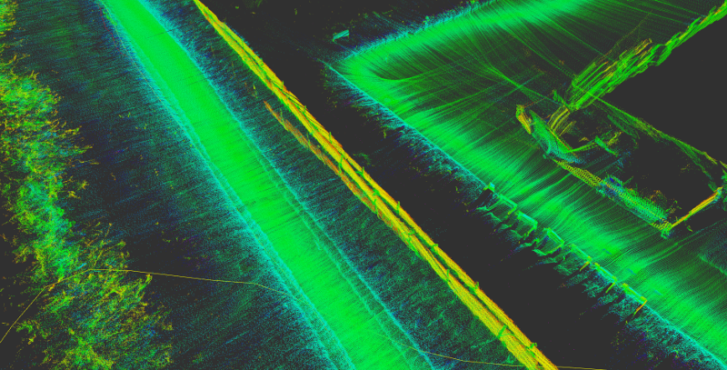

# GPS Localization
A gps localization ros node.

This node uses odometry and gps as an input and calculates the globally correct position of the robot.
This is done using a feature transform to be robust to outliers.

The results are so good, you can use 2d laserscans and construct a 3d world by using the poses returned by the node.



## Install

Clone this repository into your catkin workspace source folder.

```bash
cd catkin_ws/src
git clone https://github.com/Kamaro-Engineering/gps_localization.git
```

(Optional) Make the catkin workspace with catkin.
```bash
catkin_make
```

## Usage

Source your ros and devel/setup.bash.

```bash
cd catkin_ws
source /opt/ros/kinetic/setup.bash
source devel/setup.bash
```

Check the launch files in the `launch` folder and fix all paths and topic names to meet your needs.

Run the node live or use a rosbag.
```bash
roslaunch gps_localization test_run.launch
# or
roslaunch gps_localization bag_run.launch
```
